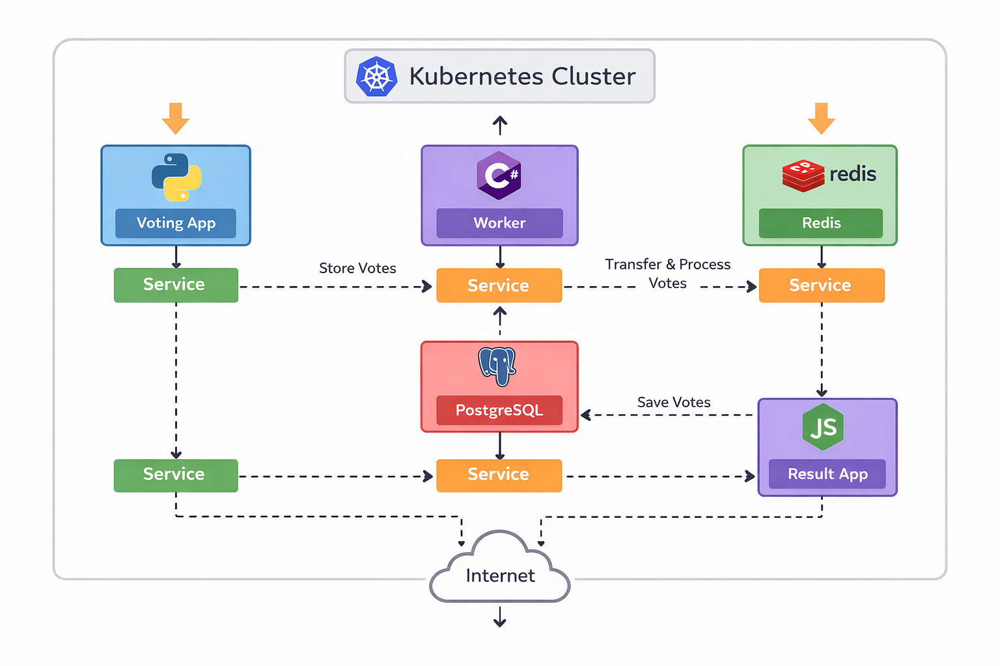

# Kubernetes-Based Voting Application

This project demonstrates the deployment of a **microservices-based voting application** on **Kubernetes**, following a real-world container orchestration and service communication model.

# 📌 Project Overview

The application allows users to vote between two options. Votes are processed using multiple services, each built with a different technology stack, showcasing a polyglot microservices architecture.

# 🏗️ Architecture



**Flow:**
User → Voting App → Redis → Worker → PostgreSQL → Result App

# Components:

* Voting App (Python): Web interface to collect user votes
* Redis: Temporary in-memory storage for votes
* Worker App (.NET): Processes votes from Redis and stores them in PostgreSQL
* PostgreSQL: Permanent database for processed votes
* Result App (Node.js): Displays live voting results

All components run as Pods inside a Kubernetes cluster and communicate via Kubernetes Services.

# 🛠️ Technologies Used

* Docker
* Kubernetes
* Python
* Redis
* .NET
* PostgreSQL
* Node.js
* YAML

# 📂 Kubernetes Manifests

The repository contains the following Kubernetes YAML files:

* `voting-app-pod.yml`
* `voting-app-service.yml`
* `redis-pod.yml`
* `redis-service.yml`
* `worker-app-pod.yml`
* `postgres-pod.yml`
* `postgres-service.yml`
* `result-app-pod.yml`
* `result-app-service.yml`

# 🚀 Deployment Steps

1. Clone the repository:

   ```bash
   git clone https://github.com/syedafnan17/SyedAfnan_kube_project.git
   cd SyedAfnan_kube_project
   ```

2. Create Pods and Services:

   ```bash
   kubectl apply -f .
   ```

3. Verify resources:

   ```bash
   kubectl get pods
   kubectl get services
   ```

4. Access the applications:

   * Voting App: via LoadBalancer / NodePort / Port Forward
   * Result App: via NodePort or Port Forward

## 🔍 Key Learnings

* Hands-on experience with Kubernetes Pods and Services
* Service discovery and inter-service communication
* Debugging Kubernetes issues (CrashLoopBackOff, YAML errors)
* Exposing applications using NodePort and LoadBalancer
* Managing multi-container applications in a cluster


# 📈 Future Enhancements

* Deploy on AWS EKS
* Add CI/CD pipeline (GitHub Actions / Jenkins)
* Use Helm charts
* Add monitoring with Prometheus & Grafana

## 👤 Author

**Afnan Syed**
Aspiring DevOps Engineer

🔗 GitHub: [https://github.com/syedafnan17](https://github.com/syedafnan17)


⭐ If you found this project helpful, feel free to star the repository!
